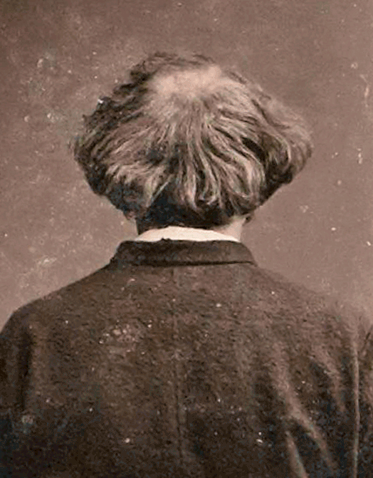

| Inventore | Etienne-Jules Marey, medico fisiologo francese |
| ---- | ---- |
| Periodo storico di massima diffusione | 1888~1980 |
| Strumenti impiegati | Cronofotografo |
| Procedure impiegate | Fotografia semplice per la popolazione generale |

## Nadar

Nadar è un fotografo parigino che offre il proprio spazio espositivo per i giovani impressionisti sperimentalisti rifiutati al salon. Nadar con il suo atelier 

## Edward Muybridge 

Muybridge fu un vero e proprio sperimentalista del movimento, sfrutto e fece sua la cronofotografia per studiare i movimenti di animali, come uomini e cavalli, i quali palesarono gli errori anatomici commessi precedentemente da pittori come Gericault. 

La raccolta delle fotografie di Muybridge si chiama Animal Locomotion, contiene 781 tavole e fu pubblicata nel 1887. 

![[Pasted image 20240103194621.png]]
Wild Animals and Birds, Animal Locomotion, Edward Muybridge

